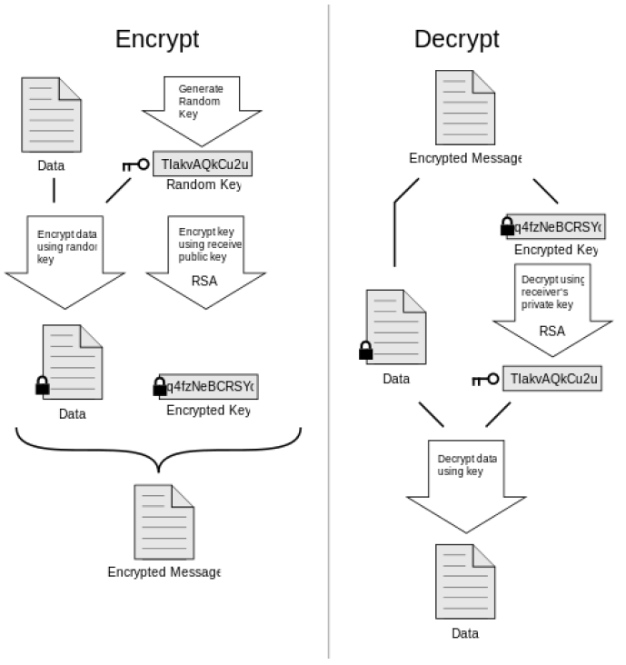

# EasyPGE
Easy Security is a user-friendly email client supporting the basic features in email clients. In addition, it provides an easy way for non-technologically inclined users to encrypt their email conversations.

## Full Description
### Summary

EasySecurity is a user friendly email client with support for all the basic features in email clients including folders, push notifications for received emails, an address book and the sending and receiving of emails. In addition to that, it strives to provide an easy way for the non-technologically inclined users to encrypt their email conversations so even if their email accounts or devices were compromised, a hacker can’t read the contents of their emails and can’t impersonate them and send emails under their names. EasySecurity follows the OpenPGP protocol to encrypt, digitally sign and decrypt incoming emails. When a user wishes to send an email to one of his contacts, the program checks if this contact’s public key is saved in its database, if it’s not saved it asks for the user to enter the recipient’s public key. Afterwards, the program generates a random key and encrypts it using the recipient’s public key, then encrypts the email using the random generated key and signs it using RSA algorithm, and includes the sender’s public key in the email. When the recipient’s receives the email while using EasySecurity, the program will automatically detect that the email is encrypted and signed, and with the user approval the decryption process starts and the email is turned again into plaintext using the recipient’s private key stored in the program’s database, all in a seamless process without needing anything from either the sender or receiver other than a preset password that is set with the first run of EasySecurity. EasySecurity can connect to most widely-used email service providers including Gmail, Yahoo and Hotmail and uses Internet Message Access Protocol (IMAP) to retrieve the emails from the server. As a result, if an encrypted email sent using EasySecurity is accessed on the default web client of the email service provider, only the ciphered text will be visible and the plaintext of the email won’t be reachable without the private key of the intended recipient of the email which is hidden away under a strong randomly generated preset password, achieving maximum privacy without any need for strong security knowledge or complicated steps.

### Pretty Good Privacy (PGP)

Pretty Good Privacy (PGP) is an encryption program that provides cryptographic privacy and authentication for data communication. PGP is often used for signing, encrypting, and decrypting texts, e-mails, files, directories, and whole disk partitions and to increase the security of e-mail communications.

### IMAP (Internet Message Access Protocol)

IMAP (Internet Message Access Protocol) is a standard email protocol that stores email messages on a mail server, but allows the end user to view and manipulate the messages as though they were stored locally on the end user's computing device(s). This allows users to organize messages into folders, have multiple client applications know which messages have been read, flag messages for urgency or follow-up and save draft messages on the server.
